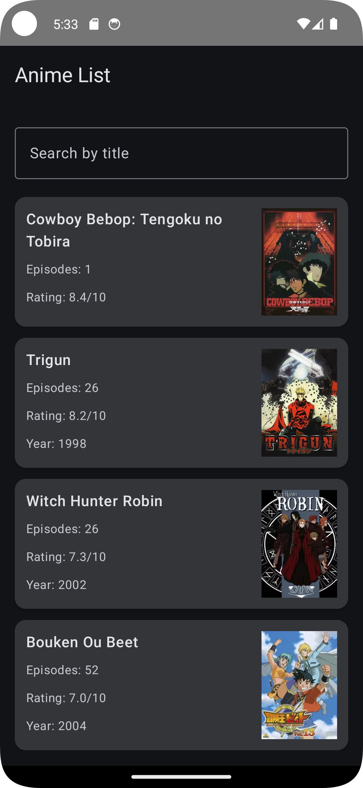

#  Anime App (Jikan API)

Цигельник Юля 
Б9124-09.03.03пикд(3)

---

## API

Проект использует **Jikan API**  
https://api.jikan.moe/v4/

---

## Что за API

Jikan API — это бесплатный REST API для получения данных с сайта MyAnimeList.

Он предоставляет:
- список аниме
- поиск по названию
- подробную информацию об аниме
- рейтинг, жанры, студии, количество эпизодов
- изображения постеров

---

##  Возможности приложения

Приложение позволяет:

- Просматривать список аниме
- Искать аниме по названию
- Открывать детальную информацию

---

## Скриншоты

### Главный экран

### Поиск

### Деталка
