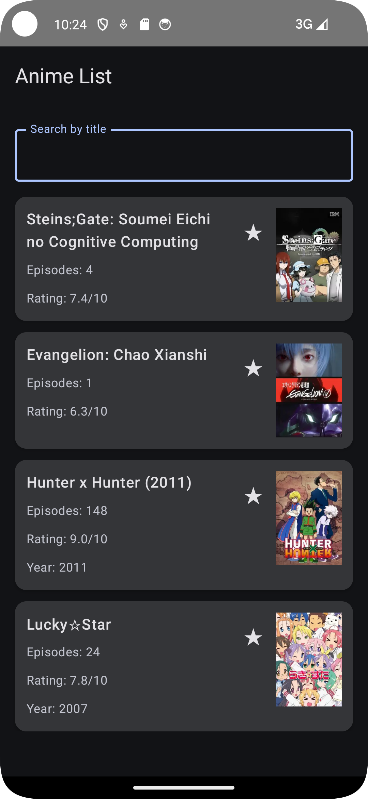
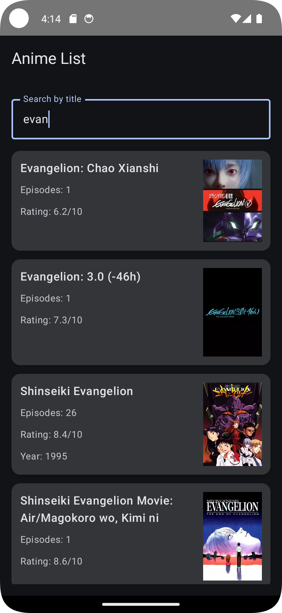
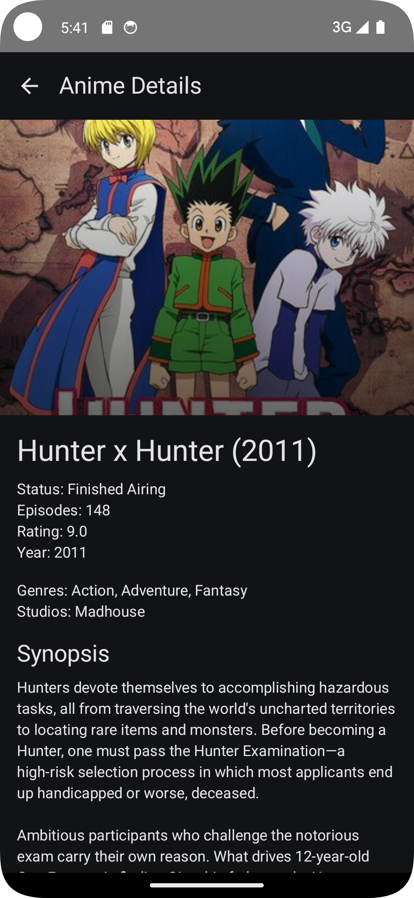

#  Anime App (Jikan API)

Цигельник Юля 
Б9124-09.03.03пикд(3)

---

## API

Проект использует **Jikan API**  
https://api.jikan.moe/v4/

---

## API

**Jikan API** (非公式 MyAnimeList API)  
- Документация: https://docs.api.jikan.moe/

---

##  Room 

### Таблица: `favourites_anime`

| Поле | Тип | Описание |
|------|-----|----------|
| `id` | `Int` | Уникальный идентификатор аниме (Primary Key) |
| `title` | `String` | Название аниме |
| `imageUrl` | `String?` | URL изображения постера |
| `episodes` | `Int?` | Количество эпизодов |
| `rating` | `Double?` | Рейтинг аниме (0-10) |
| `year` | `Int?` | Год выпуска |

### Сценарий использования

Пользователь может добавлять аниме в избранное и удалять из него.  
Данные сохраняются в локальной базе Room и переживают перезапуск приложения.

---

## Скриншоты

### Главный экран

### Поиск

### Деталка
